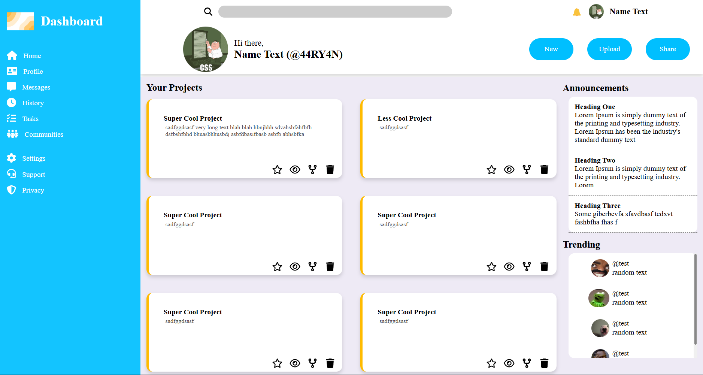

# 🧩 Admin Dashboard — Responsive Layout & Interactivity

A fully responsive admin dashboard project built with CSS Grid and enhanced using JavaScript for interactive features like dynamic project management, profile zoom effects, and a sliding profile reveal. Designed with attention to modern UI/UX principles.

---

## 🌐 Live Demo

🔗 [View Site](https://44ry4n.github.io/admin-dashboard/index.html)

---

## 🖼️ Preview

 <!-- Replace with actual path if needed -->

---

## 🛠️ Tech Stack

- **HTML5** – Semantic structure
- **CSS3** – CSS Grid, transitions, responsiveness
- **JavaScript (ES6)** – DOM manipulation, dynamic element creation, event listeners

---

## 🔍 Features

- 🔧 **Add/Remove Projects**: Users can dynamically create and delete project cards
- 🖼️ **Profile Image Zoom**: Click the avatar for a zoom overlay with background dimming
- 🎯 **Profile Reveal Slider**: Smooth header drop-down animation on "Profile" click
- 🧱 **CSS Grid Layout**: Clean, modern layout that adapts across screen sizes
- 🌀 **Smooth Transitions**: Reusable animation classes for polished UI interactions
- 📱 **Fully Responsive**: Optimized for both desktop and mobile views

---

## 🗂️ Project Structure

admin-dashboard/                                                    
├── index.html                                                                      
├── style.css                                                                       
├── script.js                                                                           
├── images/                                                             
│ ├── log.png                                                                                                                                     
│ └── logo.png                                                                                                                           
└── README.md                                                                                                                                        

The following project implements grid layouts to achieve a responsive and simplistic dashboard design, using HTML, CSS and Javascript.

Features

-A Profile and Home Switch transition which is simplistic and unique
-Enables the user to add or delete projects from the webpage using the "NEW" button
-added wiggling animations for better UI experience
-added a zoom feature where the user is able to zoom on profile at home page

thankYou
please check out the page here and try out the functionalities 

[ Cick here to check out the Page ](https://44ry4n.github.io/admin-dashboard/index.html)

44RY4N